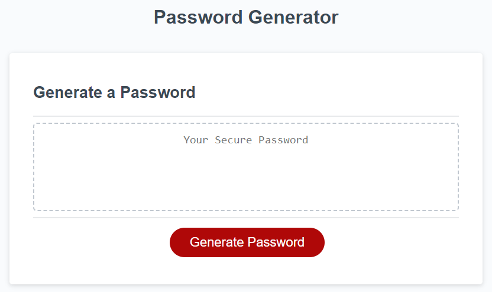

# Password-Generator

### Description
The password generator application is designed to return a password based on the users input.
Upon clicking the red Generate Password button you will be prompted to select the type of password that you would like.
After entering all the required fields you will be given the password that you asked for.

### How to use

<ul>
<li>Click the Generate Password button to display the password options</li>
<li>Enter L for an alphabet password, N for a numbered password, or B for a combination of both</li>
<li>Enter the length of the option selected between 8 - 128 characters</li>
<li>Enter Y to include special characters or N to not include special characters</li>
<li>Enter Y to include capital letters or N to not include capital letters if the option is available.
</ul>

### Link

Please click the link to access the Password Generator
<a href="https://andy316c.github.io/Password-Generator/">Click here</a>